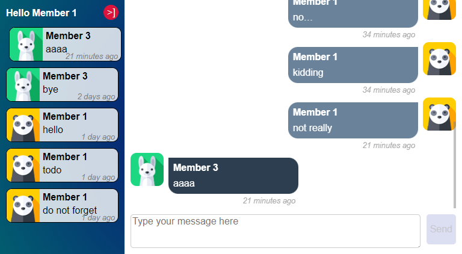

# Angular Chat Application

This Angular project is a chat application designed to demonstrate real-time communication capabilities using Angular and WebSocket. It features a dynamic conversation list component that allows users to interact and engage in conversations seamlessly.



## Project Structure

The core of the application resides in `/src/app/`, where the main components, services, and models are defined. The `ConversationListComponent` is a key component that manages the display of conversations and integrates various services for real-time data handling.

## Features

- Real-time chat functionality
- Dynamic conversation list
- User authentication and management
- Responsive design for various screen sizes

## Getting Started

### Prerequisites

- Node.js and npm (Node Package Manager)
- Angular CLI

### Installation

Clone the repository and navigate to the project directory:

```bash
git clone https://github.com/JeremieGPerso/ChatRoom.git
cd ChatRoom
```

Install the required npm packages:

```bash
npm install
```

### Running the application

Lauch the frontend server:

```bash
npm run start
```

Lauch the backend server:

```bash
npm run startserver
```

Navigate to http://localhost:4200/ to view the application.

### Members of chatroom

There are three members included for testing:

| User              | Password |
|-------------------|----------|
| member1@test.com  | pass1    |
| member2@test.com  | pass2    |
| member3@test.com  | pass3    |

## Development Highlights

* WebSocket Integration: Utilizes WebSocketService for real-time messaging.
* State Management: Leverages Angular's Store for managing the state of members and conversations.
* Service Injection: Demonstrates the use of Angular's dependency injection for services like MembersService and ConversationsService.
